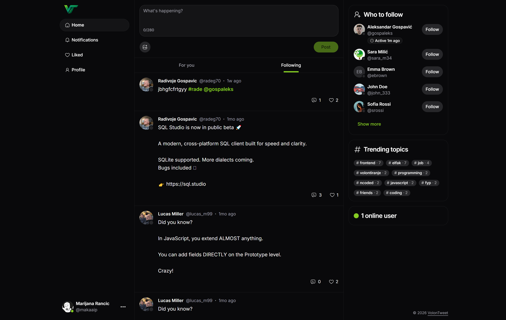
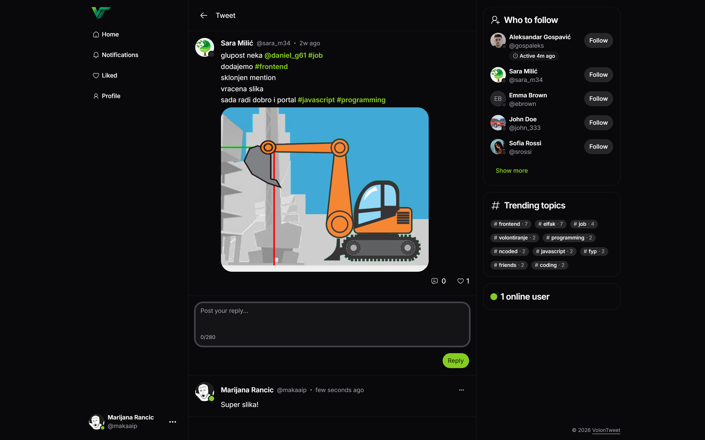
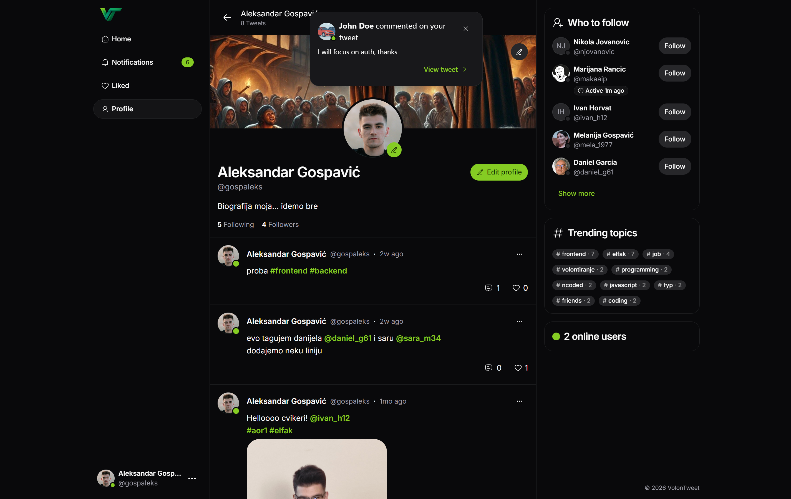
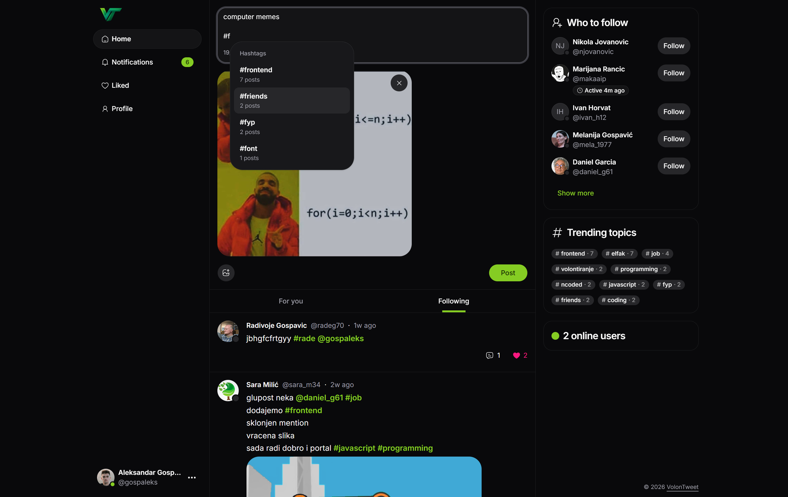

# VolonTweet

VolonTweet is a **student project** developed for the **Advanced Databases** course.

The main focus of the project is on:

- **Neo4j** (graph database, user relationships, follows, recommendations, and similar features)
- **Redis** (caching, fast data operations, and supporting real-time functionality)

## Running the Project with Docker

### Prerequisites

You need to have installed:

- Docker Desktop (with Docker Compose support)

### 1) Start the Full System

From the project root folder, run:

```bash
docker compose up --build -d
```

This command:

- builds backend and frontend images
- starts all services in detached mode (`-d`)
- starts services in the following order:
  1. databases (`postgres`, `neo4j`, `redis`)
  2. `backend`
  3. `frontend`

The backend uses **LOCAL** variables (`LOCAL_*`) inside the Docker network, so it connects to Dockerized databases (not cloud services).

### 2) Verify Everything Is Running

Check container statuses:

```bash
docker compose ps
```

Useful URLs after startup:

- Frontend: http://localhost:5173
- Backend API: http://localhost:3000
- Neo4j Browser: http://localhost:7474

### 3) Logs (Optional)

If you want to follow logs:

```bash
docker compose logs -f
```

Backend logs only:

```bash
docker compose logs -f backend
```

## Stopping the Project

### Standard Stop

```bash
docker compose down
```

This stops and removes containers and the network, while keeping volumes preserved.

### Full Stop (Including Volume Data Removal)

```bash
docker compose down -v
```

Use this only when you want a completely clean database reset.

## Application Screenshots





